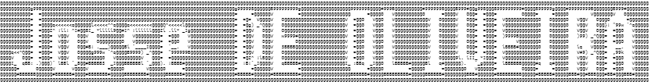

<h1>Webjosse, French Student
</h1>
<h2>
🌐 Web dev lover 🌐
</h2>

### Web-oriented knowledges
    
 

### Other programming skills
  
  

### Project management/organization
 

### Game dev (for fun only)

